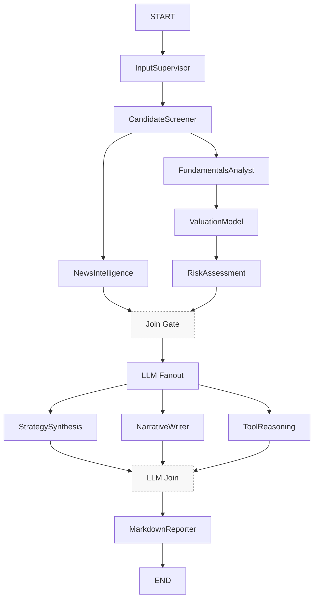

# 巴菲特風格多代理 MVP
本儲存庫實作一個可投入生產的、受巴菲特啟發的美股研究管線。系統使用 LangGraph 協作專職代理，完成輸入正規化、候選篩選、基本面蒐集、新聞整合、內在價值評估、風險評估，並輸出精簡的 Markdown 研究報告。
## 功能
- **LangGraph 編排**：決定性狀態機，按序在 InputSupervisor → CandidateScreener → FundamentalsAnalyst/NewsIntelligence（並行）→ ValuationModel → RiskAssessment → StrategySynthesis/NarrativeWriter/ToolReasoning（並行）→ MarkdownReporter 之間傳遞結果。

### 流程步驟詳解

每個代理只負責單一職責；狀態鍵以增量方式合併，避免並行覆寫。

1. **InputSupervisor**（`agents/input_supervisor.py`）
    - 目的：正規化使用者輸入的 tickers（大小寫、去重），可套用 `max_candidates` 上限。
    - 輸入鍵：`params.tickers`、`params.max_candidates`
    - 輸出鍵：`candidates`（初始可能為空）
    - 邊界情況：未提供 tickers 時，保留空清單交由後續 Screener 處理。

2. **CandidateScreener**（`agents/candidate_screener.py`）
    - 目的：透過產業與關鍵字擴展候選（Yahoo Finance 搜尋 + 排行）。
    - 輸入鍵：`params.sector`、`params.query`、既有 `candidates`（種子）
    - 輸出鍵：`candidates`（排序且唯一）
    - 回退：若 API 無結果但有種子，則沿用種子。

3. **FundamentalsAnalyst**（`agents/fundamentals_analyst.py`）
    - 目的：抓取基本面與 1 年價格歷史；計算巴菲特指標（ROIC、毛利率、營益率、FCF CAGR、Debt/FCF）。
    - 輸入鍵：`candidates`
    - 輸出鍵：`fundamentals`（每檔含 `info`、`metrics`、`price_history`）
    - 健壯性：缺失數值時以 None 表示，避免拋錯。

4. **NewsIntelligence**（`agents/news_intelligence.py`）【與 Fundamentals 並行】
    - 目的：彙整近期新聞與關鍵字搜尋；去重、視窗篩選、摘要、情緒、主題、時間軸。
    - 輸入鍵：`candidates`、`params.query`、`params.news_window_days`、`params.max_news`
    - 輸出鍵：`news_bundle`（每檔含 bullets、sentiment、topics、timeline、sources）
    - 回退：若無項目，提供預設提示。

5. **ValuationModel**（`agents/valuation_model.py`）
    - 目的：結合 DCF 與倍數估值，得到區間與安全邊際（MOS）。
    - 輸入鍵：`fundamentals`
    - 輸出鍵：`valuation`（每檔含 price、intrinsic_value_range、margin_of_safety）
    - 假設：折現率 10%、終端增長 2%、終端倍數 15x。

6. **RiskAssessment**（`agents/risk_assessment.py`）
    - 目的：保守規則過濾（高槓桿 vs FCF、FCF 負增長）與倉位限制。
    - 輸入鍵：`fundamentals`、`valuation`
    - 輸出鍵：`risk`（flags、allowed、position_weight、margin_of_safety）
    - 政策：僅在 MOS > 0 且槓桿可接受時給予最大倉位（預設 10%）。

7. **StrategySynthesis**（`agents/strategy_synthesis.py`）
    - 目的：LLM（或啟發式回退）產出倉位策略與理由。
    - 輸入鍵：`fundamentals`、`valuation`、`risk`
    - 輸出鍵：`llm_strategy`（每檔含 strategy_comment）
    - 回退：無 OpenAI 金鑰或模型不可用時，輸出可預期的中文摘要。

8. **NarrativeWriter**（`agents/narrative_writer.py`）
    - 目的：LLM（或啟發式）整合敘事（護城河、估值、情緒、風險、追蹤重點）。
    - 輸入鍵：`fundamentals`、`valuation`、`risk`、`news_bundle`
    - 輸出鍵：`llm_narrative`（每檔含 narrative）
    - 回退：從可得指標與情緒組裝條列。

9. **ToolReasoning**（`agents/tool_reasoning.py`）
    - 目的：以工具核對（價格、基本面、新聞）並輸出精簡驗證摘要。
    - 輸入鍵：`valuation`、`risk`、`news_bundle`、`fundamentals`
    - 輸出鍵：`llm_tool_agent`（每檔含 tool_summary）
    - 韌性：若無法使用 create_react_agent，退化為簡易執行器。

10. **MarkdownReporter**（`agents/markdown_reporter.py`）
     - 目的：為每檔股票組裝最終 Markdown 報告。
     - 輸入鍵：前述所有輸出；若 `fundamentals` 缺失則以 `candidates` 骨架輸出。
     - 輸出鍵：`report_path`（最後產生的路徑）
     - 章節：摘要、護城河、財務表、估值、風險、新聞、LLM Strategy、LLM Narrative、LLM Tool Agent。

### 資料流與 Join Gate
並行：FundamentalsAnalyst 與 NewsIntelligence 於 CandidateScreener 後並行執行。Join Gate 確保在進入 LLM 階段前，同時具備新聞與風險（取決於估值/基本面）。接著由 llm_fanout 觸發三個 LLM 節點（StrategySynthesis / NarrativeWriter / ToolReasoning）並行執行，最終於 llm_join 匯流，再交由 Reporter 產出報告。

### 狀態鍵總覽
`params`、`candidates`、`fundamentals`、`news_bundle`、`valuation`、`risk`、`llm_strategy`、`llm_narrative`、`llm_tool_agent`、`report_path`

所有節點只回傳增量（delta，更新子集），以避免並行寫入衝突。


## 架構（視覺化）



簡述：
- Screener 之後並行執行基本面與新聞管線，於 Join Gate 匯流後進入 LLM 並行階段（由 llm_fanout 觸發，llm_join 匯流）。
- Reporter 支援在缺基本面時以 candidates 輸出骨架報告（容錯）。

## 快速開始
1. 安裝相依套件：`pip install -r requirements.txt`
2. （選用）啟用 OpenAI LLM 多代理，在環境變數設定金鑰：

```bash
export OPENAI_API_KEY=sk-your-key
# optional: override model
export OPENAI_MODEL=gpt-4o-mini
```

3. 執行管線：

```bash
python main.py --tickers AAPL,MSFT --news-window 14 --max-news 30
```

4. 在 `reports/` 檢視輸出（例如 `reports/20251109_AAPL.md`）。
    - 若未設定 `OPENAI_API_KEY`，LLM 節點會回退為可預期的啟發式輸出，報告仍包含「LLM Strategy / LLM Narrative」章節。
## 測試

執行完整套件：

```bash
pytest
```

## 設定

環境變數：

- `REPORTS_DIR`：覆寫報告輸出目錄。

也可在呼叫 `graph.run_pipeline` 時，於輸入字典中直接提供這些值。

## 專案結構

```
README.md
requirements.txt
main.py
agents/
    input_supervisor.py
    candidate_screener.py
    fundamentals_analyst.py
    news_intelligence.py
    valuation_model.py
    risk_assessment.py
    strategy_synthesis.py
    narrative_writer.py
    tool_reasoning.py
    markdown_reporter.py
graph/
    orchestrator.py
tools/
    yfinance_client.py
    mcp_yfinance.py (compat shim)
valuation/
    dcf.py
    multiples.py
nlp/
    news_pipeline.py
reports/
    .gitkeep
tests/
    test_tools_news.py
    test_nlp_news.py
    test_valuation.py
    test_e2e.py
```
