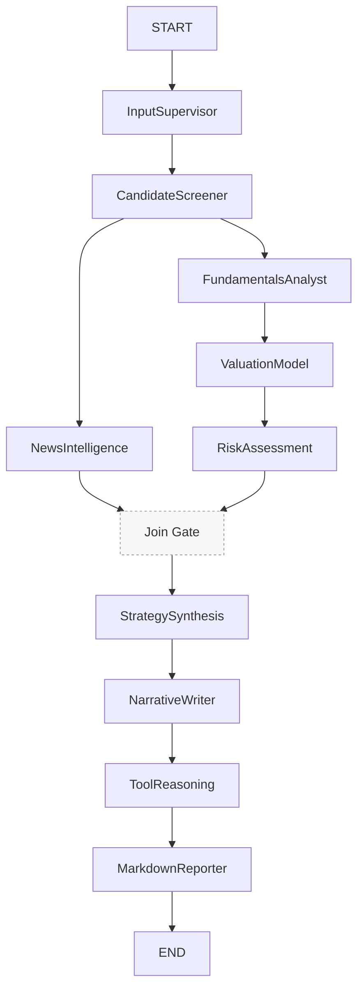

# Buffett Multi-Agent MVP
This repository implements a production-style, Buffett-inspired U.S. equity research pipeline. The system orchestrates specialized LangGraph agents that normalize inputs, screen candidates, gather fundamentals, synthesize news, run intrinsic valuation, assess risk, and export a concise Markdown research dossier.
## Features
- **LangGraph Orchestration**: Deterministic state machine that hands off results between InputSupervisor → CandidateScreener → FundamentalsAnalyst/NewsIntelligence (parallel) → ValuationModel → RiskAssessment → StrategySynthesis → NarrativeWriter → ToolReasoning → MarkdownReporter.

## Architecture (Visual)



簡述：
- Screener 之後並行執行基本面與新聞管線，於 Join Gate 匯流後進入 LLM 階段。
- Reporter 支援在缺基本面時以 candidates 輸出骨架報告（容錯）。

## Quick Start
1. Install dependencies: `pip install -r requirements.txt`
2. (Optional) Enable LLM multi-agent with OpenAI. Set your key in env:

```bash
export OPENAI_API_KEY=sk-your-key
# optional: override model
export OPENAI_MODEL=gpt-4o-mini
```

3. Run the pipeline:
4. Inspect generated reports under `reports/` (e.g., `reports/20251109_AAPL.md`).
    - If no `OPENAI_API_KEY` is set, the LLM nodes fall back to deterministic heuristics and the report still includes "LLM Strategy" and "LLM Narrative" sections with fallback content.
## Project Layout
# Buffett Multi-Agent MVP

This repository implements a production-style, Buffett-inspired U.S. equity research pipeline. The system orchestrates specialized LangGraph agents that screen candidates, gather fundamentals, synthesize news, run intrinsic valuation, assess risk, and export a concise Markdown research dossier.

## Features

- **LangGraph Orchestration**: Deterministic state machine that hands off results between InputSupervisor, CandidateScreener, FundamentalsAnalyst, NewsIntelligence, ValuationModel, RiskAssessment, and MarkdownReporter agents.
- **Direct yfinance Tooling**: Resilient wrappers around Yahoo Finance using the `yfinance` package with Pydantic I/O validation, retries, and structured responses.
- **Buffett-Focused Analytics**: Financial quality metrics (ROIC, margins, FCF CAGR, debt coverage), multi-method valuation (DCF + multiples), and conservative sizing rules.
- **News Intelligence**: NLP utility for deduplication, summarization, timeline building, sentiment estimation, and topic tagging within a configurable lookback window.
- **Reproducible CLI**: `python main.py --tickers AAPL,MSFT --news-window 14 --max-news 30` generates dated Markdown reports in `reports/`.
- **Test Coverage**: Pytest suite validating tool behavior, NLP routines, valuation math, and a mocked end-to-end run.

## Quick Start

1. Install dependencies: `pip install -r requirements.txt`
2. Run the pipeline:

```bash
python main.py --tickers AAPL,MSFT --news-window 14 --max-news 30
```

4. Inspect generated reports under `reports/` (e.g., `reports/20251109_AAPL.md`).

## Testing

Run the full suite:

```bash
pytest
```

## Configuration

Environment variables:

- `REPORTS_DIR`: Override where reports are saved.

These values can also be supplied directly to `graph.run_pipeline` via the `input` dictionary.

## Project Layout

```
README.md
requirements.txt
main.py
agents/
    input_supervisor.py
    candidate_screener.py
    fundamentals_analyst.py
    news_intelligence.py
    valuation_model.py
    risk_assessment.py
    strategy_synthesis.py
    narrative_writer.py
    tool_reasoning.py
    markdown_reporter.py
graph/
    orchestrator.py
tools/
    yfinance_client.py
    mcp_yfinance.py (compat shim)
valuation/
    dcf.py
    multiples.py
nlp/
    news_pipeline.py
reports/
    .gitkeep
tests/
    test_tools_news.py
    test_nlp_news.py
    test_valuation.py
    test_e2e.py
```
